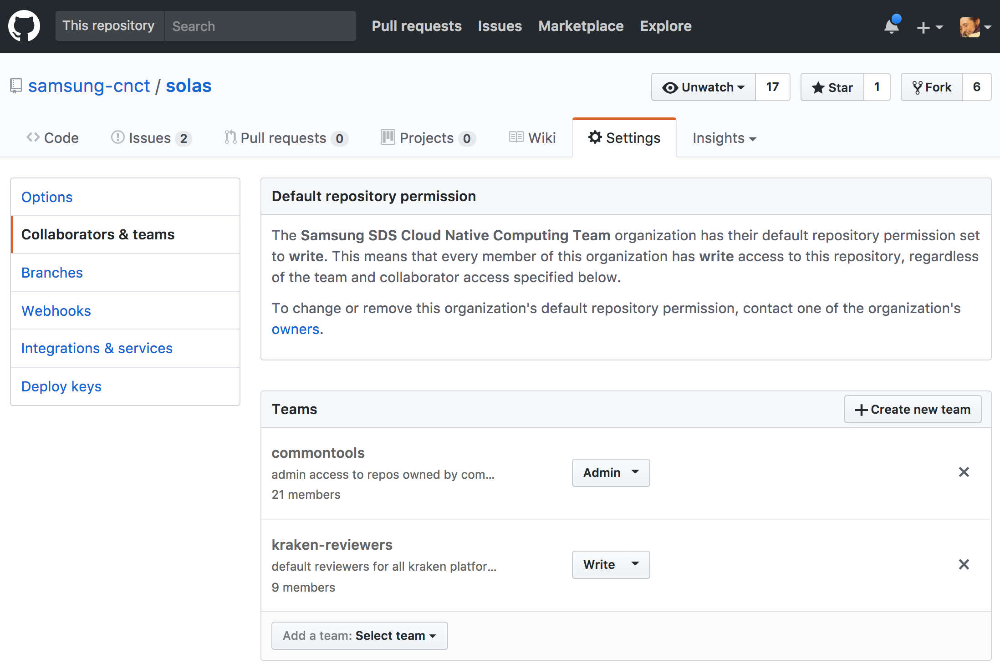
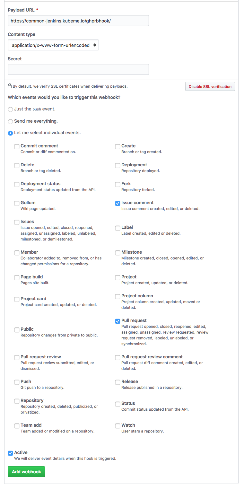

# Overview

'Webhooks' allow Github to notify our Jenkins CI/CD service whenever there is
a change which must be built, tested, and deployed to our Quay registry (e.g.
whenever a PR is submitted, merged, etc.). By configuring 'Collaborators &
teams' you can ensure your project can take advantage of peer review from the
start.

The following assumes a repository which has been duplicated according to
the instructions in the [README](../README.md).

## Configure Collaborators & Teams

From the 'Settings' section, go to the 'Collaborators & teams' tab, then
add `commontools` as a team with admin privileges (required for
[slack](./docs/slack.md) notifications, and `kraken-reviewers` as a team
with write privileges (required for [CODEOWNERS](./CODEOWNERS)).

## Jenkins Webhooks

Within your GitHub repository, go to settings and add the following webhooks:

### Normal Webhook

* URL should be `https://common-jenkins.kubeme.io/github-webhook/`
* Select `Send me everything`

### GitHub Pull Request Builder Webhook

* URL should be `https://common-jenkins.kubeme.io/ghprbhook/`
* Select `Let me select individual events.` and choose:
  * Issue comment
  * Pull Request

