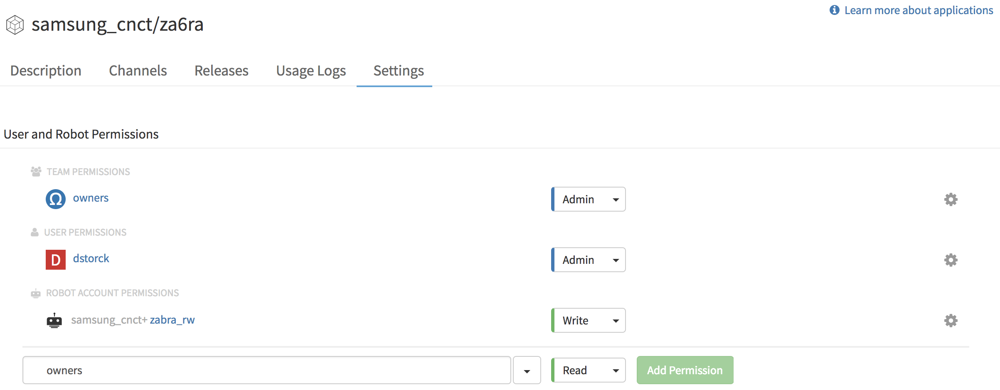

# Overview

Quay is a container and application repository/registry service, used to host
artifacts generated by [Jenkins](./jenkins.md). `solas-container` derived
[GitHub](./github/.md) repositories generate container artifacts stored in a
[Quay Container Repository](https://quay.io/repository/). `solas-chart` derived
repositories generate helm chart artifacts which are stored in the
[Quay Application Registry](https://quay.io/application/). Hosting these
artifacts in Quay makes sharing with others easy. This guide will show you how
to create repositories and prepare for Jenkins to take over.

The following assumes a repository which has been duplicated according to the
instructions in the [README](../README.md).

## [Create](https://docs.quay.io/guides/create-repo.html) a repository

Artifacts for the Samsung CNCT organization, are stored in the `samsung_cnct`
namespace. By convention, the name of the artifact depends on where it came
from. For container repositories, e.g. `container-zabra`, the artifact is named
`zabra-container`. For application repositories, e.g. `chart-zabra`, the
artifact is named simply `zabra`. This is done because the application, and not
the container, is generally the artifact we expect users to interact with.

* Go to [quay.io](https://quay.io) and login if you are not already logged in.

* Click the `+` icon in the top right of the page, near your name, and select
`New Repository` .

* Select `Container Repository`, for `solas-container` derived repositories

* Select `Application Repository`, for `solas-chart` derived repositories

* Choose `samsung_cnct` for the namespace.

* Enter the name of the artifact. For example, `zabra-container` or `zabra`.


* For `Initialize repository` select `(Empty repository)`.

* Write a helpful description, it will never hurt!

* Make the repository public or private as appropriate.

* Finish creating the repository by clicking `Create Public Repository` or
`Create Private Repository`.

## Create a robot account

A robot account is used to authenticate and authorize access to the repositories
hosted by Quay. Jenkins needs access to push artifacts to the registry.
We use a different robot account for each repository because this improves
auditing and prevents some mistakes (e.g. a build job accidently publishing to
the wrong repository).

By convention, robot accounts are named after the artifact they are associated
with, and the permissions they grant. Dashes are not allowed in robot names, so
they are replaced by underscores. For example, read/write premissions for
the `zabra-container` artifact  are named `zabra_container_rw`. The same
permissions for `zabra` are `zabra_rw`.

* Go to your repository's settings
* Under the section ` User and Robot Permissions`
  * Click Create Robot Account from the `Select a team or user` drop down menu
  * Name your robot according to the convention above
  * Grant the robot `write` access
  * While you have settings open, click `Owners` from the `Teams` section of the drop down menu and grant `admin` privileges



### Add Kubernetes Secret to Production Cluster for your robot

To allow Jenkins to use the robot to access Quay, a Kubernetes Secret can be
created. This is preferred over other methods of passing secrets because it
allows us to reuse production Kubernetes processes (e.g. monitoring, logging,
auditing, backups, etc.).

By convention, Kubernetes secrets are named after the artifact they give
permissions for, and the permissions they give. For example,
`quay-robot-zabra-container-rw` or `quay-robot-zabra-rw`.

* Log in to the CNCT production cluster using
[these](https://github.com/samsung-cnct/docs/blob/master/cnct/production-kubernetes-cluster.md)
instructions.

* Go to https://quay.io/organization/samsung_cnct?tab=robots and find your
robot.

* Click on Docker Login

* Calculate base64 encoded docker username and password (the `tr` command may be required on OSX). Username and password can be copied from the displayed command for docker login. 
```
echo -n 'samsung_cnct+zabra_r' | base64 | tr -d '\n'
echo -n '<robot's_docker_password>' | base64 | tr -d '\n'
```

  * Create a [Kubernetes Secret](https://kubernetes.io/docs/concepts/configuration/secret/)
to bring this configuration into the cluster. First create a file named `secret.yaml` containing
the values calculated above.

```
apiVersion: v1
kind: Secret
metadata:
  name: quay-robot-zabra-container-rw
  namespace: common-jenkins
type: Opaque
data:
  username: <encoded_docker_username>
  password: <encoded_docker_password>
```

Then run `kubectl create -f secret.yaml` to create the secret.

Finally, if you have not already done so, head to the Jenkinsfile for your
repo, and edit the `robot_secret` to be `quay-robot-zabra-container-rw`
or `quay-robot-zabra-rw`
